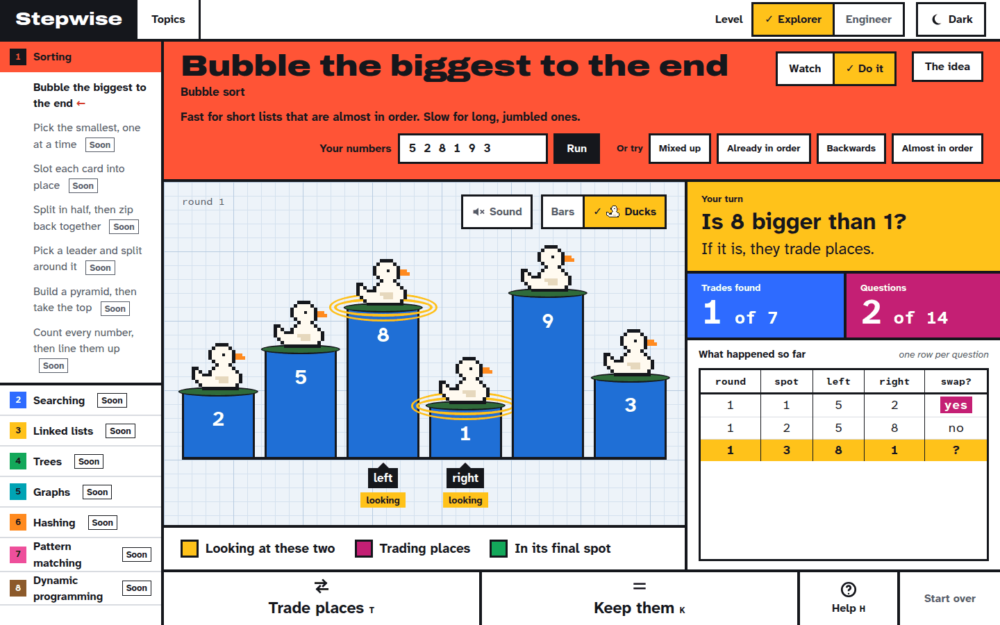
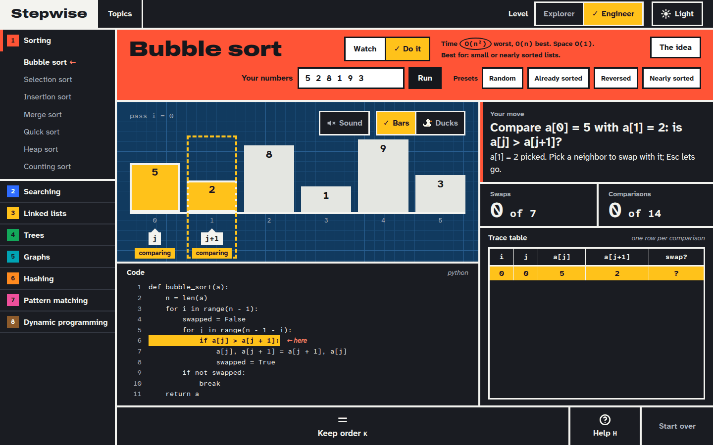

# Stepwise

[](https://github.com/nakucoder/stepwise/actions/workflows/ci.yml)

**Try it live: [stepwise-lab.pages.dev](https://stepwise-lab.pages.dev)**

Stepwise is a website for learning data structures and algorithms by watching them run one step
at a time. It starts with the idea: why the algorithm works the way it does, answered in plain
words or precise ones. Then play it or step forward and backward through it, and every step is
explained at the level you choose: plain words for beginners, or precise terms with the
matching line of code highlighted. A trace table and running counts of comparisons and swaps
make time complexity something you can watch grow, not just memorize. Type your own numbers or
pick a ready-made list (mixed up, already sorted, reversed, nearly sorted), and share the exact
run with a link.

Then switch from **Watch** to **Do it** and sort the numbers yourself. Explorer asks one plain
question at a time ("Is 8 bigger than 1?"); Engineer gives no prompts: you swap two values or
keep their order, and the site checks each move against the algorithm. A wrong move is never
punished: help opens one step at a time, from where to look, to the rule, to "Show me". Today
that's bubble sort; more algorithms follow.

<p>
  
  
</p>
<p align="center"><em>The same step of bubble sort in Explorer (light) and Engineer (dark).</em></p>

<p>
  
   a[j+1]?”, the value 2 picked with a dashed outline while waiting for its neighbor, counters for swaps and comparisons, and Keep order and Help buttons along the bottom.">
</p>
<p align="center"><em>Do it mode: Explorer answers questions; Engineer makes the swaps.</em></p>

> **Status:** live at [stepwise-lab.pages.dev](https://stepwise-lab.pages.dev). Bubble sort
> is built in both learning levels, to watch (step controls, the trace table, the code panel)
> or to do yourself (Do it mode, with hints), on your own numbers or a preset, on desktop and
> phones. The other algorithms are listed but not built yet.

## Features

- Step-by-step visualizations, starting with sorting algorithms
- Learning levels (Explorer / Engineer): friendly, jargon-free explanations for kids and
  beginners, or precise technical ones. Chosen by you, never based on age.
- Step forward and backward, play/pause, and animation speed control
- Your own input or a randomly generated one
- Source code with the active line highlighted (Python first, more languages later)
- An explanation of every step, written for your chosen level
- Labeled index pointers (`i`, `j`, `low`, `mid`, `high`) drawn on the visualization
- Live comparison and swap counters
- Do it mode: sort the numbers yourself, with every move checked and a hint ladder (where to
  look, the rule, Show me) when you want help
- Bath time: an Explorer look that draws each value as a column of water with a duck on top
- Sound, muted until you turn it on, that repeats what the stage shows
- Light and dark themes, and a layout of its own for phones in both orientations
- Full keyboard control (Space = play/pause, arrows = step; in Do it mode, T / K / H answer,
  and Engineer picks values with the arrows and Enter)

## Tech stack

- [Vite](https://vite.dev/) + [React](https://react.dev/) + [TypeScript](https://www.typescriptlang.org/) (strict mode)
- [Vitest](https://vitest.dev/) + [React Testing Library](https://testing-library.com/docs/react-testing-library/intro/)
- [ESLint](https://eslint.org/) + [Prettier](https://prettier.io/)
- Plain CSS with design tokens as CSS custom properties

## Getting started

Requires Node 22.22 or newer (Node 24 LTS recommended; see `.nvmrc`).

```bash
git clone https://github.com/nakucoder/stepwise.git
cd stepwise
nvm use            # optional, picks up the version from .nvmrc
npm install
npm run dev
```

Then open the URL that Vite prints (usually http://localhost:5173).

## Scripts

| Script                 | What it does                           |
| ---------------------- | -------------------------------------- |
| `npm run dev`          | Start the development server           |
| `npm run build`        | Typecheck and build for production     |
| `npm run preview`      | Serve the production build locally     |
| `npm run lint`         | Lint with ESLint                       |
| `npm run format`       | Format all files with Prettier         |
| `npm run format:check` | Check formatting without writing       |
| `npm run typecheck`    | Typecheck with the TypeScript compiler |
| `npm test`             | Run the test suite once                |
| `npm run test:watch`   | Run tests in watch mode                |
| `npm run check:csp`    | Check the built page's CSP script hash |
| `npm run check`        | Run every check CI runs, in order      |

## Deployment

Stepwise is a static site on [Cloudflare Pages](https://pages.cloudflare.com/) (free plan).
GitHub Actions runs every check, then deploys: pushes to `main` go to production, and each pull
request gets its own preview link. Details are in the "Deploy" section of
[CLAUDE.md](CLAUDE.md).

## Roadmap

- **Phase 1: Algorithm visualizer.** Sorting algorithms first, then searching, trees, and
  graphs, with a category sidebar and a focused visualization workspace.
- **Phase 2: LeetCode practice layer.** Problems organized by pattern (two pointers, sliding
  window, binary search, and so on), with spaced repetition to schedule reviews.
- **Phase 3: Object-oriented programming.** Classes, the four pillars (encapsulation,
  abstraction, inheritance, polymorphism), live UML class diagrams, and design patterns.
  Planned only; not yet built.

Feature ideas for each phase (trace panel, Big O explorer, everyday examples, and more) are
collected in [docs/ROADMAP.md](docs/ROADMAP.md).

## Inspiration

Stepwise is inspired by these excellent teaching tools:

- [VisuAlgo](https://visualgo.net/) by Steven Halim and team
- [CSVisTool](https://csvistool.com/) from Georgia Tech's CS 1332
- [Data Structure Visualizations](https://www.cs.usfca.edu/~galles/visualization/) by David
  Galles, University of San Francisco

All code and design in Stepwise are original. No code, assets, or designs were copied from
these projects.

## License

[MIT](LICENSE) © Juan Spinelli
