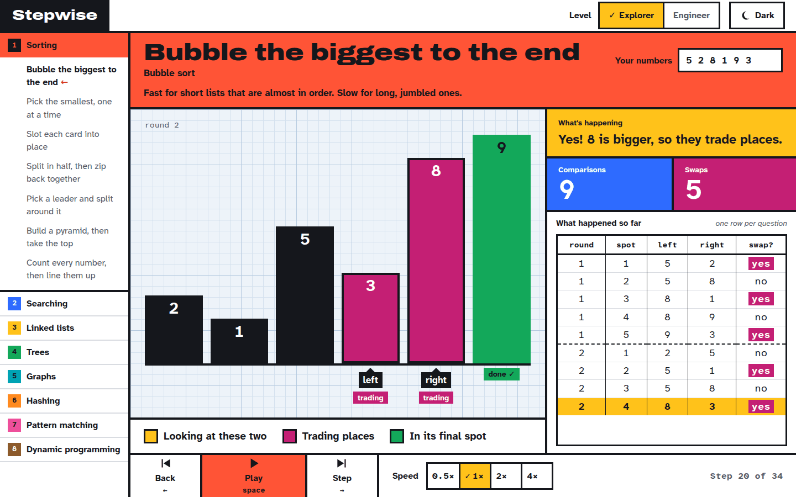
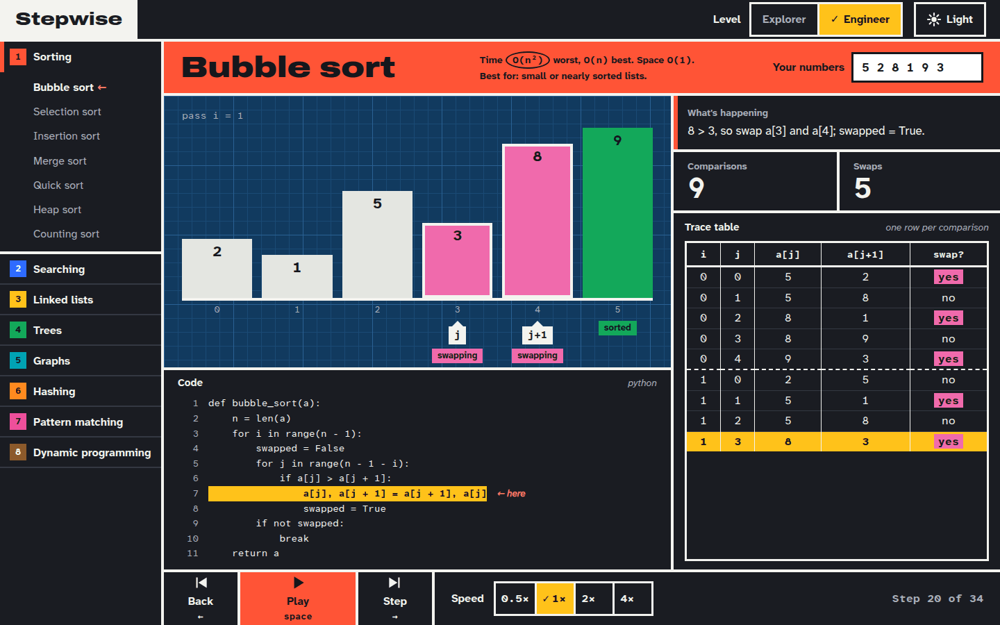

# Stepwise

[](https://github.com/nakucoder/stepwise/actions/workflows/ci.yml)

Stepwise is a website for learning data structures and algorithms by watching them run one
step at a time. Enter your own input, then step forward and backward through the algorithm
while the matching line of code is highlighted and each step is explained at your chosen level.
Running counts of comparisons and swaps make time complexity something you can watch grow,
not just memorize.

<p>
  
  
</p>
<p align="center"><em>The same step of bubble sort in Explorer (light) and Engineer (dark).</em></p>

> **Status:** early scaffolding. No algorithms are implemented yet.

## Planned features

- Step-by-step visualizations, starting with sorting algorithms
- Learning levels (Explorer / Engineer): friendly, jargon-free explanations for kids and
  beginners, or precise technical ones. Chosen by you, never based on age.
- Step forward and backward, play/pause, and animation speed control
- Your own input or a randomly generated one
- Source code with the active line highlighted (Python first, more languages later)
- An explanation of every step, written for your chosen level
- Labeled index pointers (`i`, `j`, `low`, `mid`, `high`) drawn on the visualization
- Live comparison and swap counters
- Light and dark themes
- Full keyboard control (Space = play/pause, arrows = step)

## Tech stack

- [Vite](https://vite.dev/) + [React](https://react.dev/) + [TypeScript](https://www.typescriptlang.org/) (strict mode)
- [Vitest](https://vitest.dev/) + [React Testing Library](https://testing-library.com/docs/react-testing-library/intro/)
- [ESLint](https://eslint.org/) + [Prettier](https://prettier.io/)
- Plain CSS with design tokens as CSS custom properties

## Getting started

Requires Node 22.22 or newer (Node 24 LTS recommended; see `.nvmrc`).

```bash
git clone https://github.com/nakucoder/stepwise.git
cd stepwise
nvm use            # optional, picks up the version from .nvmrc
npm install
npm run dev
```

Then open the URL that Vite prints (usually http://localhost:5173).

## Scripts

| Script                 | What it does                           |
| ---------------------- | -------------------------------------- |
| `npm run dev`          | Start the development server           |
| `npm run build`        | Typecheck and build for production     |
| `npm run preview`      | Serve the production build locally     |
| `npm run lint`         | Lint with ESLint                       |
| `npm run format`       | Format all files with Prettier         |
| `npm run format:check` | Check formatting without writing       |
| `npm run typecheck`    | Typecheck with the TypeScript compiler |
| `npm test`             | Run the test suite once                |
| `npm run test:watch`   | Run tests in watch mode                |
| `npm run check`        | Run every check CI runs, in order      |

## Roadmap

- **Phase 1: Algorithm visualizer.** Sorting algorithms first, then searching, trees, and
  graphs, with a category sidebar and a focused visualization workspace.
- **Phase 2: LeetCode practice layer.** Problems organized by pattern (two pointers, sliding
  window, binary search, and so on), with spaced repetition to schedule reviews.
- **Phase 3: Object-oriented programming.** Classes, the four pillars (encapsulation,
  abstraction, inheritance, polymorphism), live UML class diagrams, and design patterns.
  Planned only; not yet built.

Feature ideas for each phase (trace panel, Big O explorer, everyday examples, and more) are
collected in [docs/ROADMAP.md](docs/ROADMAP.md).

## Inspiration

Stepwise is inspired by these excellent teaching tools:

- [VisuAlgo](https://visualgo.net/) by Steven Halim and team
- [CSVisTool](https://csvistool.com/) from Georgia Tech's CS 1332
- [Data Structure Visualizations](https://www.cs.usfca.edu/~galles/visualization/) by David
  Galles, University of San Francisco

All code and design in Stepwise are original. No code, assets, or designs were copied from
these projects.

## License

[MIT](LICENSE) © Juan Spinelli
